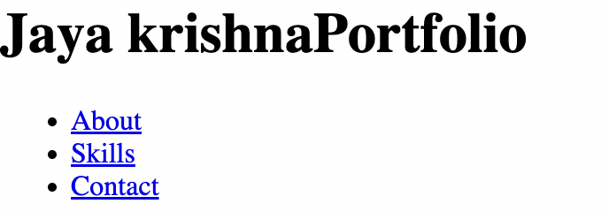
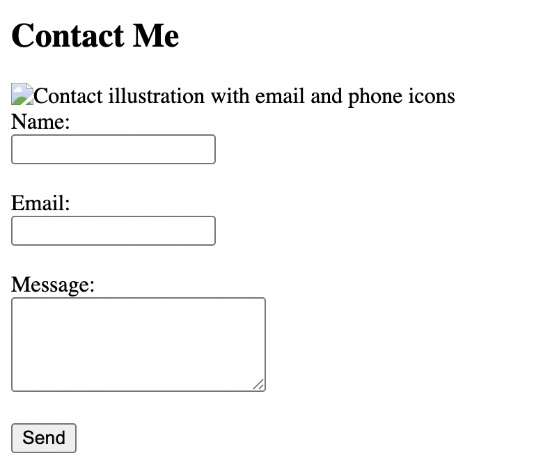
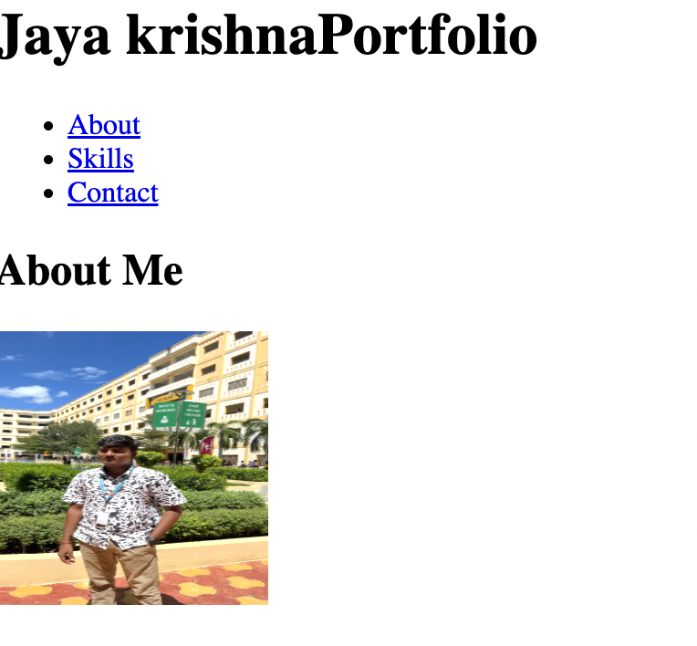

# 🌐 Portfolio Website

## 🧾 Project Overview and Objectives

This project is a personal portfolio website built using HTML. It showcases my profile, skills, and contact details in a structured format.

### 🎯 Objectives
- Learn basic HTML structure  
- Use semantic HTML tags  
- Create multiple sections (About, Skills, Contact)  
- Build a simple contact form  
- Practice clean and organized coding  

---

## ⚙️ Setup and Installation Instructions

### 📌 Requirements
- Visual Studio Code  
- Web browser (Chrome / Safari)

### 🚀 Steps to Run
1. Create a folder named `portfolio`  
2. Open the folder in VS Code  
3. Create a file named `index.html`  
4. Add your HTML code  
5. Open the file in a browser  

---

## 🏗️ Code Structure Explanation

The project uses semantic HTML for better structure and readability.

### 📌 Main Structure

- `<header>` → Contains name and navigation menu  
- `<nav>` → Navigation links  
- `<main>` → Main content area  
- `<section>` → Divided into:
  - About
  - Skills
  - Contact  
- `<footer>` → Footer content  

### 📌 Section Details

- **About Section**
  - Includes personal introduction and profile image  

- **Skills Section**
  - Displays skills using list tags (`<ul>`, `<li>`)  

- **Contact Section**
  - Contains a form with input fields and validation  

---

## 🖼️ Screenshots of Working Application

Example:
- Header section  
- About section  
- Contact form  

---

## 🧠 Explanation of Technical Requirements

### ✅ HTML5 Structure
- Used `<!DOCTYPE html>`, `<html>`, `<head>`, `<body>`

### ✅ Semantic HTML Tags
- Used `<header>`, `<nav>`, `<main>`, `<section>`, `<footer>`

### ✅ Navigation
- Implemented internal links using `<a href="#section">`

### ✅ Contact Form
- Used:
  - `input type="text"`
  - `input type="email"`
  - `textarea`
- Added `required` validation  

### ✅ Images
- Added images using ``  
- Included proper `alt` attributes  

### ✅ Code Quality
- Proper indentation  
- Clean and readable structure  

---

## 🚀 Conclusion

This project helped me understand the fundamentals of HTML and how to structure a complete webpage. It serves as a foundation for learning CSS and JavaScript in future projects.